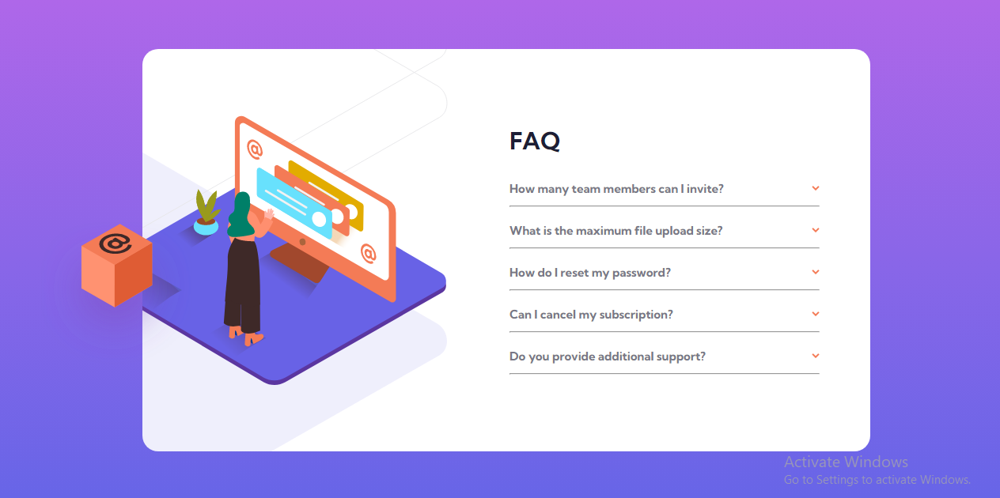

# Frontend Mentor - FAQ accordion card solution

This is a solution to the [FAQ accordion card challenge on Frontend Mentor](https://www.frontendmentor.io/challenges/faq-accordion-card-XlyjD0Oam). Frontend Mentor challenges help you improve your coding skills by building realistic projects.

## Table of contents

- [Overview](#overview)
  - [The challenge](#the-challenge)
  - [Screenshot](#screenshot)
  - [Links](#links)
- [My process](#my-process)
  - [Built with](#built-with)
  - [Useful resources](#useful-resources)
- [Author](#author)

## Overview

### The challenge

Users should be able to:

- View the optimal layout for the component depending on their device's screen size
- See hover states for all interactive elements on the page
- Hide/Show the answer to a question when the question is clicked

### Screenshot

### Links

- Solution URL: [Github](https://github.com/Emmanuel-obiora/faq-accordion-card)
- Live Site URL: [FAQ-accordion](https://your-live-site-url.com)

## My process

### Built with

- Semantic HTML5 markup
- CSS custom properties
- Flexbox
- CSS Grid
- Sass/Scss

### Useful resources

- [Web Dev Made Easy](https://www.youtube.com/watch?v=m6ZmRE1i5-A) - This helped remind the use of CSS to toggle or switch state in a webpage.

## Author

- Website - [Obiora Emmanuel](https://emmanuel-obiora.github.io/portfolio-about-me-/web-content)
- Frontend Mentor - [@Emmanuel-obiora](https://www.frontendmentor.io/profile/Emmanuel-obiora)
- Twitter - [@Miroclesdgenius](https://twitter.com/Miroclesdgenius)
